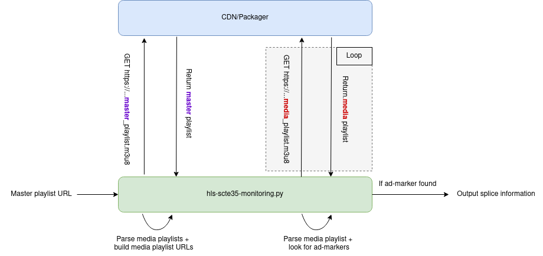
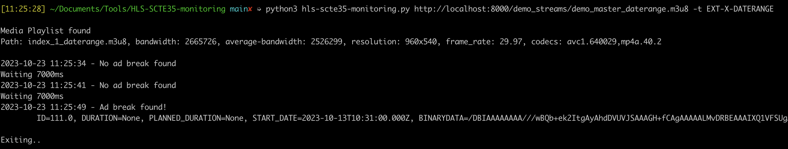
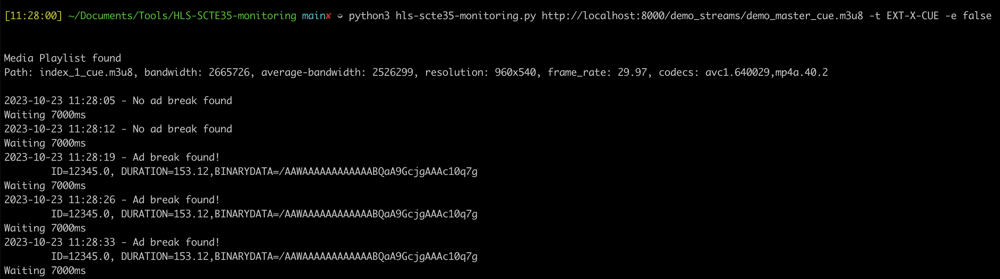
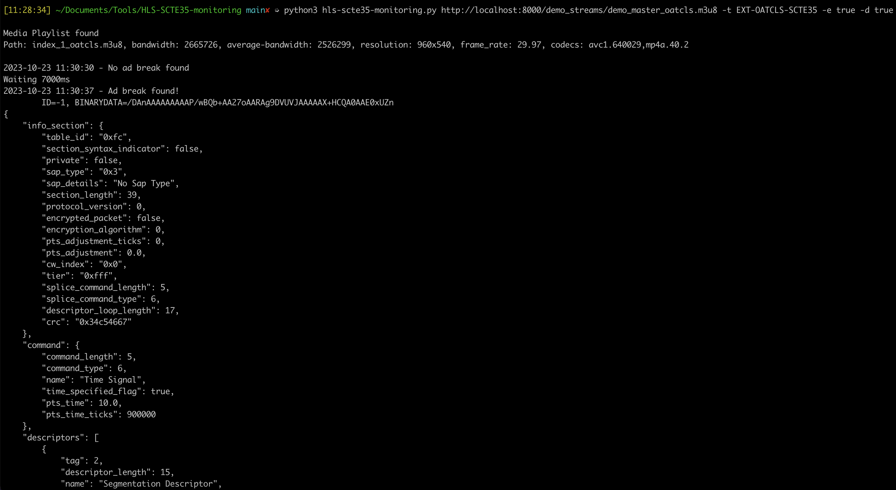

# HLS Adbreak Monitoring

This script is designed to periodically monitor an HLS stream until it detects an SCTE35 marker (cue-point) flagged with a specific tag. The supported tags include:

- [EXT-X-CUE-OUT/IN](https://support.google.com/admanager/answer/13049027?hl=en)
- [EXT-X-DATERANGE](https://datatracker.ietf.org/doc/html/draft-pantos-hls-rfc8216bis-04#section-4.4.2.7)
- [EXT-OATCLS-SCTE35](https://cloud.google.com/livestream/docs/scte-ad-break-markers)
- Any custom tag you can specify

## Purpose

This project serves as a tool for monitoring and analyzing ad-markers in HLS media playlists. It can be valuable for content creators, broadcasters, or developers who need to track and understand ad-markers for various purposes, such as ad insertion or content analytics.


## How It Works



1. **Input HLS Master Playlist URL**: Provide your master playlist URL as a parameter for the script. The URL format must be HTTP(S) and end with a valid .m3u8 extension (query parameters are supported).

2. **Add optional parameters**: Details about optional parameters can be found in the  [Usage](#Usage) below

3. **Let it run for a while**: The script will periodically scan each rendition of the master playlist, search for ad-marker-related tags, sleep for the chunk duration, and fetch the updated version of the playlist until it finds a keyword to stop.

4. **Analyse Results**: The output is returned to the standard output (stdout).

## Usage

```bash
# Install Python Dependencies
pip3 install -r requirements.txt
```

```bash
usage: hls-scte35-monitoring.py [-h] [-e EXIT_IF_FOUND] [-d DECODE] [-t ADBREAK_TYPE | -c CUSTOM_MATCH] master_playlist_url

positional arguments:
  master_playlist_url

options:
  -h, --help            show this help message and exit
  -e EXIT_IF_FOUND, --exit-if-found EXIT_IF_FOUND
                        Stop script after the first ad break is being found, default True
  -d DECODE, --decode DECODE
                        Decode SCTE35 binarydata (hex or base64). Works only for tags where the binarydata can be parsed from the tag
  -t ADBREAK_TYPE, --ad-break-type ADBREAK_TYPE
                        Ad break types to match: EXT-X-CUE, EXT-X-DATERANGE, EXT-OATCLS-SCTE35 or ALL, default ALL
  -c CUSTOM_MATCH, --custom CUSTOM_MATCH
                        Define a custom keyword to match
```

## Examples

<details>
<summary><ins>Example</ins>: Look for any EXT-X-DATERANGE tag and stop once found</summary>

```bash
python3 hls-scte35-monitoring.py http://localhost:8000/demo_streams/demo_master_daterange.m3u8 -t EXT-X-DATERANGE
```



</details>

<details>
<summary><ins>Example</ins>: Look for any EXT-X-CUE-OUT tag and never stop</summary>

```bash
python3 hls-scte35-monitoring.py http://localhost:8000/demo_streams/demo_master_cue.m3u8 -t EXT-X-CUE -e false
```


</details>

<details>
<summary><ins>Example</ins>: Look for any EXT-X-OATCLS tag, stop once found and decode its binarydata</summary>

```bash
python3 hls-scte35-monitoring.py http://localhost:8000/demo_streams/demo_master_oatcls.m3u8 -t EXT-OATCLS-SCTE35 -e true -d true
```



</details>

<br/>
*You can customize the script to monitor the presence of any string. It may not be related to ad-markers at all.*

<details>
<summary><ins>Example</ins>: Monitor if the tag EXT-X-DISCONTINUITY appears in a rendition of the playlist</summary>

```bash
python3 hls-scte35-monitoring.py http://localhost:8000/demo_stream/demo_master.m3u8 -c EXT-X-DISCONTINUITY
```

</details>

*If you do not know what kind of tags are present in the playlists, you can use -t ALL to match any of the supported ad-marker tags*


## Dependencies

- [argsparse](https://docs.python.org/3/library/argparse.html)
- [threefive](https://github.com/futzu/scte35-threefive)

## License

This project is released under the [MIT License](LICENSE).

---

**Note:** HLS-SCTE35-Monitoring is a side project and provided as-is. It may require adjustments and improvements to meet your specific use case.
